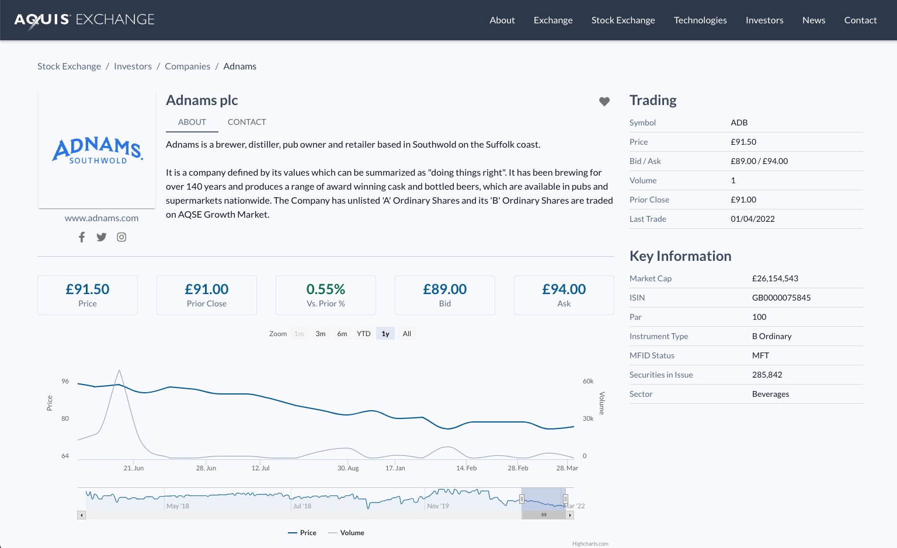

# Aquis Exchange | Company Profile Page

## About
**Goals**

Redesign the company profile page of Aquis Exchange

**Timeline**

~ 1 day of work 

## Links
- deployed: https://eloquent-torte-48cbb1.netlify.app/
- repo: https://github.com/agarioch/aq-ex

## Scope of Work

**In Scope**

- ✅ Figma Design
- ✅ React Frontend development

**Partially In Scope**
- 🔸 Responsiveness (desktop & tablet layouts)

**Descoped due to time constraints**
- ❌ Backend Development (using static mock data)
- ❌ Accessibility (important but would need more time)
- ❌ Automated Tests (important but would need more time)
- ❌ Cross-Browser Testing (only tested on latest Chrome browser)
- ❌ Performance Optimization (not reviewed)

## Process

### Built With
- Typescript
- React
- Highcharts
- Material UI